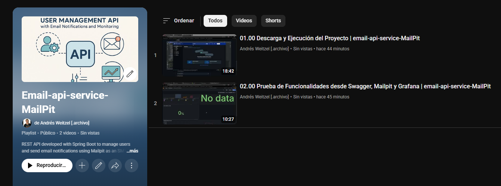

<div align="center">
  
</div>

<div align="right">
    
    
    
    
    
    
    
	  
       
    
    
    
    
</div>

<br>

<br>

<div align="right">
  <a href="./src/main/resources/static/translations/README.es.md" target="_blank">
    
  </a>
  <a href="./README.md" target="_blank">
    
  </a>
</div>


<br>

<div align="center">

# User Management Email API 

</div>

A comprehensive REST API developed with Spring Boot to manage users and send email notifications using Mailpit as the SMTP server. It integrates seamlessly with PostgreSQL for data storage, and includes features for audit logging, Prometheus monitoring, Grafana dashboards, and automatic API documentation with Swagger/OpenAPI.

*   [Functional test playlist](https://www.youtube.com/playlist?list=PLCl11UFjHurDSHfBJ-uQp55RG-xhL162C) <a href="https://www.youtube.com/playlist?list=PLCl11UFjHurDSHfBJ-uQp55RG-xhL162C" target="_blank"> </a>

<br>

## Index 📜

<details>
  <summary> View details </summary>

<div align="right">

`Latest update: 20/02/26` 

</div>

### Section 1) Description, Configuration and Technologies

*   [1.0) Project Description.](#10-project-description-)
*   [1.1) Project Execution.](#11-project-execution-)
*   [1.2) Project Structure.](#12-project-structure-)
*   [1.3) Technologies.](#13-technologies-)

### Section 2) Endpoints and Examples

*   [2.0) Endpoints and Resources.](#20-endpoints-and-resources-)
*   [2.1) User Management Examples.](#21-user-management-examples-)
*   [2.2) Audit Log Examples.](#22-audit-log-examples-)
*   [2.3) Mailpit Email Examples.](#23-mailpit-email-examples-)

### Section 3) Processing Flow, Validations and Monitoring

*   [3.0) Processing Flow.](#30-processing-flow-)
*   [3.1) Implemented Validations.](#31-implemented-validations-)
*   [3.2) Monitoring & Reports.](#32-monitoring--reports-)

### Section 4) Functionality Testing, Contributing and License

*   [4.0) Functionality Test.](#40-functionality-test-)
*   [4.1) Contributing.](#41-contributing-)
*   [4.2) License.](#42-license-)

<br>

</details>

<br>

## Section 1) Description, Configuration and Technologies

### 1.0) Project Description [🔝](#index-)

<details>
   <summary>View details</summary>

  <br>

A comprehensive REST API developed with Spring Boot to manage users and send email notifications using Mailpit as the SMTP server. It integrates seamlessly with PostgreSQL for data storage, and includes features for audit logging, Prometheus monitoring, Grafana dashboards, and automatic API documentation with Swagger/OpenAPI.

**Key Features:**

* User Management: Complete CRUD operations for user management
* Email Notifications: Automated email sending for user events
* Audit Logging: Comprehensive tracking of all system actions
* Monitoring: Real-time metrics and health checks
* API Documentation: Interactive Swagger UI for API exploration
* Containerization: Easy deployment with Docker
* Database Integration: Robust PostgreSQL integration
* Metrics Visualization: Grafana dashboards for system monitoring

**Requirements:**

* Java 17 or higher
* Docker and Docker Compose
* Maven for building the project
* PostgreSQL (if running without Docker)
* Mailpit (if running without Docker)

<br>

</details>

### 1.1) Project Execution [🔝](#index-)

<details>
   <summary>View details</summary>

<br>

#### [Watch Functional test playlist](https://www.youtube.com/playlist?list=PLCl11UFjHurDSHfBJ-uQp55RG-xhL162C)

  <a href="https://www.youtube.com/playlist?list=PLCl11UFjHurDSHfBJ-uQp55RG-xhL162C">
    
  </a> 

<br>

#### Repository Clone
```git
git clone https://github.com/andresWeitzel/email-api-service-MailPit
cd email-api-service-MailPit
```

#### Docker Compose Setup for Development

* Before building and running the containers, make sure you have Docker running (for Windows, use [Docker Desktop](https://www.docker.com/products/docker-desktop/))
* Once installed, make sure Docker is running
```git
docker --version
```
`Important`: Check that no other service (e.g.: postgres) is running as a daemon on the system, otherwise a connection problem will occur on the port.

* Once Docker is running, you can build and deploy the containers with docker compose (This command is only needed once to build).
* The container for Mailpit and Postgres will be created. 
```git
docker-compose up --build
```

* After creating the containers with Docker Compose, each time we are going to start the containers we will use the following command, otherwise we will run it from Docker Desktop. Start the environment in development mode. Every time you want to run the app in development, you won't need to compile the jar. Simply run the following command:
```git
docker-compose up
```
* Another option is to launch the containers from Docker Desktop.
* Run the application
```git
mvn spring-boot:run
```

<br>

</details>

### 1.2) Project Structure [🔝](#index-)

<details>
   <summary>View details</summary>

  <br>

```
email-api-service-MailPit/
├── src/
│   ├── main/
│   │   ├── java/com/microservice/
│   │   │   ├── config/           # Configuration classes
│   │   │   ├── controller/       # REST controllers
│   │   │   ├── dto/             # Data Transfer Objects
│   │   │   ├── exception/       # Exception handlers
│   │   │   ├── model/           # Entity models
│   │   │   ├── repository/      # Data access layer
│   │   │   ├── service/         # Business logic
│   │   │   └── EmailApiMailpitApplication.java
│   │   └── resources/
│   │       ├── application.yml  # Application configuration
│   │       └── static/          # Static resources
│   └── test/                    # Test classes
├── docker-compose.yml           # Docker orchestration
├── Dockerfile                   # Application container
├── pom.xml                      # Maven dependencies
└── README.md                    # Project documentation
```

#### Key Components

* **Controllers**: Handle HTTP requests and responses
* **Services**: Implement business logic
* **Repositories**: Data access layer
* **DTOs**: Data transfer objects for API communication
* **Models**: JPA entities for database mapping
* **Config**: Application configuration classes
* **Exceptions**: Custom exception handling

<br>

</details>

### 1.3) Technologies [🔝](#index-)

<details>
   <summary>View details</summary>

  <br>

| **Technology** | **Purpose** |
| ------------- | ------------- |
| [Spring Boot](https://spring.io/projects/spring-boot) | Core framework for building Java applications |
| [Spring Boot Starter Web](https://docs.spring.io/spring-boot/docs/current/reference/htmlsingle/) | For creating RESTful web applications |
| [Spring Boot Starter Mail](https://docs.spring.io/spring-boot/docs/current/reference/htmlsingle/) | For handling emails |
| [Spring Boot Starter Data JPA](https://docs.spring.io/spring-boot/docs/current/reference/htmlsingle/) | For database operations |
| [Spring Boot Starter Actuator](https://docs.spring.io/spring-boot/docs/current/reference/htmlsingle/) | For monitoring and metrics |
| [PostgreSQL](https://www.postgresql.org/) | Database for data persistence |
| [Mailpit](https://mailpit.axllent.org/) | SMTP server for local email testing |
| [Docker & Docker Compose](https://www.docker.com/) | For containerization and orchestration |
| [Prometheus](https://prometheus.io/) | For metrics collection |
| [Grafana](https://grafana.com/) | For metrics visualization |
| [Swagger/OpenAPI](https://swagger.io/) | For API documentation |
| [Lombok](https://projectlombok.org/) | For reducing boilerplate code |
| [JUnit](https://junit.org/) | For unit testing |
| [Log4j](https://logging.apache.org/log4j/) | For application logging |
| [Maven](https://maven.apache.org/) | Build and dependency management |
| [Git](https://git-scm.com/) | Version control |
| [Postman](https://www.postman.com/) | API testing |

<br>

</details>

<br>

## Section 2) Endpoints and Examples

### 2.0) Endpoints and Resources [🔝](#index-)

<details>
   <summary>View details</summary>

<br>

#### Audit Log API

  - `POST /api/v1/audit-log`  
  ➡️ [http://localhost:8080/api/v1/audit-log](http://localhost:8080/api/v1/audit-log)

  - `PUT /api/v1/audit-log/{id}`  
    ➡️ [http://localhost:8080/api/v1/audit-log/{id}](http://localhost:8080/api/v1/audit-log/1)
  
  - `DELETE /api/v1/audit-log/{id}`  
    ➡️ [http://localhost:8080/api/v1/audit-log/{id}](http://localhost:8080/api/v1/audit-log/1)
  
  - `GET /api/v1/audit-log`  
    ➡️ [http://localhost:8080/api/v1/audit-log](http://localhost:8080/api/v1/audit-log)
  
  - `GET /api/v1/audit-log/entity?entity={entityName}`  
    ➡️ [http://localhost:8080/api/v1/audit-log/entity?entity=User](http://localhost:8080/api/v1/audit-log/entity?entity=User)
  
  - `GET /api/v1/audit-log/action?action={actionType}`  
    ➡️ [http://localhost:8080/api/v1/audit-log/action?action=CREATE](http://localhost:8080/api/v1/audit-log/action?action=CREATE)
  
  - `GET /api/v1/audit-log/username?username={username}`  
    ➡️ [http://localhost:8080/api/v1/audit-log/username?username=admin](http://localhost:8080/api/v1/audit-log/username?username=admin)
  
  - `GET /api/v1/audit-log/details?details={details}`  
    ➡️ [http://localhost:8080/api/v1/audit-log/details?details=Created+new+user](http://localhost:8080/api/v1/audit-log/details?details=Created+new+user)

#### User API
  
  - `POST /api/v1/users`  
    ➡️ [http://localhost:8080/api/v1/users](http://localhost:8080/api/v1/users)
  
  - `PUT /api/v1/users/{id}`  
    ➡️ [http://localhost:8080/api/v1/users/{id}](http://localhost:8080/api/v1/users/1)
  
  - `DELETE /api/v1/users/{id}`  
    ➡️ [http://localhost:8080/api/v1/users/{id}](http://localhost:8080/api/v1/users/1)
  
  - `GET /api/v1/users/{id}`  
    ➡️ [http://localhost:8080/api/v1/users/{id}](http://localhost:8080/api/v1/users/1)
  
  - `GET /api/v1/users`  
    ➡️ [http://localhost:8080/api/v1/users](http://localhost:8080/api/v1/users)

#### Swagger UI

  - `GET /swagger-ui/index.html`  
    ➡️ [http://localhost:8080/swagger-ui/index.html](http://localhost:8080/swagger-ui/index.html)

  - `GET /v3/api-docs` – OpenAPI Documentation  
    ➡️ [http://localhost:8080/v3/api-docs](http://localhost:8080/v3/api-docs)

#### Actuator Endpoints

  - `GET /actuator`  
    ➡️ [http://localhost:8080/actuator](http://localhost:8080/actuator)

  - `GET /actuator/health`  
    ➡️ [http://localhost:8080/actuator/health](http://localhost:8080/actuator/health)

  - `GET /actuator/metrics`  
    ➡️ [http://localhost:8080/actuator/metrics](http://localhost:8080/actuator/metrics)

  - `GET /actuator/prometheus`  
    ➡️ [http://localhost:8080/actuator/prometheus](http://localhost:8080/actuator/prometheus)

  - `GET /actuator/env`  
    ➡️ [http://localhost:8080/actuator/env](http://localhost:8080/actuator/env)

#### MailPit

  - `Web UI`  
    ➡️ [http://localhost:8025](http://localhost:8025)
  
  - `SMTP Server` 
    ➡️ `smtp://localhost:1025`

#### Prometheus

  - `Web UI`
    ➡️ [http://localhost:9090](http://localhost:9090)

#### Grafana

  - `Web UI` 
    ➡️ [http://localhost:3000](http://localhost:3000)  
    🧾 Default credentials:
    - User: `admin`
    - Password: `admin`

#### PostgreSQL

  - `JDBC URL`  
    ➡️ `jdbc:postgresql://localhost:5432/mydatabase`  
    *  User: `user`  
    *  Password: `password`

<br>

</details>

### 2.1) User Management Examples [🔝](#index-)

<details>
   <summary>View details</summary>

<br>

#### Create User
```bash
curl -X POST http://localhost:8080/api/v1/users \
  -H "Content-Type: application/json" \
  -d '{
    "name": "John Doe",
    "email": "john.doe@example.com"
  }'
```

**Required Fields:**
- `name`: String (mandatory) - The name of the user
- `email`: String (mandatory) - Valid email format

**Response Examples:**

**Success Response (200):**
```json
{
  "id": 1,
  "name": "John Doe",
  "email": "john.doe@example.com"
}
```

**Error Responses:**

**Validation Error (400):**
```json
{
  "errors": {
    "name": "The name is mandatory"
  },
  "timestamp": "2025-07-14T17:21:59.3410006",
  "status": 400
}
```

**Invalid Email Format (400):**
```json
{
  "errors": {
    "email": "The email is invalid"
  },
  "timestamp": "2025-07-14T17:21:59.3410006",
  "status": 400
}
```

**Duplicate Email Error (400):**
```json
{
  "errors": "Email is already in use: The email john.doe@exampletest.com already exists.",
  "timestamp": "2025-07-14T17:30:37.1875171",
  "status": 400
}
```

**📧 Mailpit Email (after successful creation):**
```
From: noreply@email-api-service.com
To: john.doe@example.com
Subject: Account register Notification

Hello John Doe,

Thank you for registering with us!
```

<br>

---

<br>

#### Get All Users
```bash
curl -X GET http://localhost:8080/api/v1/users
```

**Response Examples:**

**Success Response (200):**
```json
{
  "content": [
    {
      "id": 1,
      "name": "John Doe",
      "email": "john.doe@example.com"
    },
    {
      "id": 2,
      "name": "Jane Smith",
      "email": "jane.smith@example.com"
    }
  ],
  "pageable": {
    "sort": {
      "empty": false,
      "sorted": true,
      "unsorted": false
    },
    "offset": 0,
    "pageNumber": 0,
    "pageSize": 30,
    "paged": true,
    "unpaged": false
  },
  "totalElements": 2,
  "totalPages": 1,
  "last": true,
  "size": 30,
  "number": 0,
  "sort": {
    "empty": false,
    "sorted": true,
    "unsorted": false
  },
  "numberOfElements": 2,
  "first": true,
  "empty": false
}
```

<br>

---

<br>

#### Update User
```bash
curl -X PUT http://localhost:8080/api/v1/users/1 \
  -H "Content-Type: application/json" \
  -d '{
    "name": "John Doe Updated",
    "email": "john.updated@example.com"
  }'
```

**Response Examples:**

**Success Response (200):**
```json
{
  "id": 1,
  "name": "John Doe Updated",
  "email": "john.updated@example.com"
}
```

**Error Responses:**

**User Not Found (404):**
```json
{
  "errors": "User not found with id: 999",
  "timestamp": "2025-07-14T17:45:12.9876543",
  "status": 404
}
```

**Validation Error (400):**
```json
{
  "errors": {
    "email": "The email is invalid"
  },
  "timestamp": "2025-07-14T17:45:12.9876543",
  "status": 400
}
```

**📧 Mailpit Email (after successful update):**
```
From: noreply@email-api-service.com
To: john.updated@example.com
Subject: Account Update Notification

Hello John Doe Updated,

Your account has been successfully updated.
```

<br>

---

<br>

#### Delete User
```bash
curl -X DELETE http://localhost:8080/api/v1/users/1
```

**Response Examples:**

**Success Response (200):**
```json
{
  "id": 1,
  "name": "John Doe",
  "email": "john.doe@example.com"
}
```

**Error Response:**

**User Not Found (404):**
```json
{
  "errors": "User not found with id: 999",
  "timestamp": "2025-07-14T17:50:25.1234567",
  "status": 404
}
```

**📧 Mailpit Email (after successful deletion):**
```
From: noreply@email-api-service.com
To: john.doe@example.com
Subject: Account Deletion Notification

Hello John Doe,

Your account has been successfully deleted.
```

<br>

---

<br>

#### Get User by ID
```bash
curl -X GET http://localhost:8080/api/v1/users/1
```

**Response Examples:**

**Success Response (200):**
```json
{
  "id": 1,
  "name": "John Doe",
  "email": "john.doe@example.com",
  "createdAt": "2025-07-14T17:30:37.1875171",
  "updatedAt": "2025-07-14T17:30:37.1875171"
}
```

**Error Response:**

**User Not Found (404):**
```json
{
  "errors": "User not found with id: 999",
  "timestamp": "2025-07-14T17:50:25.1234567",
  "status": 404
}
```

<br>

---

<br>

#### HTTP Status Codes

**Common Response Status Codes:**

- **200 OK**: Request successful
- **201 Created**: Resource created successfully
- **400 Bad Request**: Validation error or invalid data
- **404 Not Found**: Resource not found
- **409 Conflict**: Resource conflict (e.g., duplicate email)
- **500 Internal Server Error**: Server error

<br>

---

<br>

#### 📧 Email Notification Summary

**Emails are sent to Mailpit ONLY for successful operations:**

✅ **CREATE User** → Welcome email sent
✅ **UPDATE User** → Update notification email sent  
✅ **DELETE User** → Deletion confirmation email sent
❌ **Validation Errors** → No email sent
❌ **Duplicate Email** → No email sent
❌ **User Not Found** → No email sent

<br>

---

<br>

#### Common Error Scenarios

**Try these to test error handling:**

**1. Create User with Missing Name:**
```bash
curl -X POST http://localhost:8080/api/v1/users \
  -H "Content-Type: application/json" \
  -d '{
    "email": "john.doe@example.com"
  }'
```
**Expected Response:**
```json
{
  "errors": {
    "name": "The name is mandatory"
  },
  "timestamp": "2025-07-14T17:21:59.3410006",
  "status": 400
}
```

**2. Create User with Invalid Email:**
```bash
curl -X POST http://localhost:8080/api/v1/users \
  -H "Content-Type: application/json" \
  -d '{
    "name": "John Doe",
    "email": "invalid-email"
  }'
```
**Expected Response:**
```json
{
  "errors": {
    "email": "The email is invalid"
  },
  "timestamp": "2025-07-14T17:21:59.3410006",
  "status": 400
}
```

**3. Create User with Duplicate Email:**
```bash
# First, create a user
curl -X POST http://localhost:8080/api/v1/users \
  -H "Content-Type: application/json" \
  -d '{
    "name": "John Doe",
    "email": "john.doe@example.com"
  }'

# Then try to create another user with the same email
curl -X POST http://localhost:8080/api/v1/users \
  -H "Content-Type: application/json" \
  -d '{
    "name": "Jane Smith",
    "email": "john.doe@example.com"
  }'
```
**Expected Response:**
```json
{
  "errors": "Email is already in use: The email john.doe@example.com already exists.",
  "timestamp": "2025-07-14T17:30:37.1875171",
  "status": 400
}
```

**📧 Mailpit Email (NO email sent for duplicate email error):**
```
No email will be sent to Mailpit when there's a duplicate email error.
The user creation fails before the email service is called.
```

**4. Get Non-existent User:**
```bash
curl -X GET http://localhost:8080/api/v1/users/999
```
**Expected Response:**
```json
{
  "errors": "User not found with id: 999",
  "timestamp": "2025-07-14T17:50:25.1234567",
  "status": 404
}
```

**📧 Mailpit Email (NO email sent for not found error):**
```
No email will be sent to Mailpit when there's a "not found" error.
The operation fails before the email service is called.
```

<br>

---

<br>

#### Step-by-Step Testing Guide

**1. Start the Application:**
```bash
docker-compose up
```

**2. Create a User:**
```bash
curl -X POST http://localhost:8080/api/v1/users \
  -H "Content-Type: application/json" \
  -d '{
    "name": "John Doe",
    "email": "john.doe@example.com"
  }'
```

**3. Check Mailpit for Email:**
- Open http://localhost:8025 in your browser
- You should see a welcome email sent to john.doe@example.com

**4. Get All Users:**
```bash
curl -X GET http://localhost:8080/api/v1/users
```

**5. Update the User:**
```bash
curl -X PUT http://localhost:8080/api/v1/users/1 \
  -H "Content-Type: application/json" \
  -d '{
    "name": "John Doe Updated",
    "email": "john.updated@example.com"
  }'
```

**6. Check Mailpit Again:**
- Refresh http://localhost:8025
- You should see an update notification email

**7. Delete the User:**
```bash
curl -X DELETE http://localhost:8080/api/v1/users/1
```

**8. Final Mailpit Check:**
- Check http://localhost:8025 one more time
- You should see a deletion confirmation email

<br>

</details>

### 2.2) Audit Log Examples [🔝](#index-)

<details>
   <summary>View details</summary>

<br>

#### Create Audit Log
```bash
curl -X POST http://localhost:8080/api/v1/audit-log \
  -H "Content-Type: application/json" \
  -d '{
    "entity": "User",
    "action": "CREATE",
    "username": "admin_user",
    "details": "Created new user account with email john.doe@example.com"
  }'
```

**Audit Log Fields:**
- `entity`: String - The entity being audited (e.g., "User")
- `action`: String - The action performed (e.g., "CREATE", "UPDATE", "DELETE")
- `username`: String - The username of the person performing the action
- `details`: String - Detailed description of the action
- `timestamp`: LocalDateTime (optional) - When the action occurred

**Response Examples:**

**Success Response (200):**
```json
{
  "message": "Audit log created successfully"
}
```

<br>

---

<br>

#### Update Audit Log
```bash
curl -X PUT http://localhost:8080/api/v1/audit-log/1 \
  -H "Content-Type: application/json" \
  -d '{
    "entity": "User",
    "action": "UPDATE",
    "username": "admin_user",
    "details": "Updated user account information"
  }'
```

**Response Examples:**

**Success Response (200):**
```json
{
  "id": 1,
  "entity": "User",
  "action": "UPDATE",
  "username": "admin_user",
  "details": "Updated user account information",
  "timestamp": "2025-07-14T17:55:42.6543210"
}
```

**Error Response:**

**Audit Log Not Found (404):**
```json
{
  "errors": "Audit log not found with id: 999",
  "timestamp": "2025-07-14T17:55:42.6543210",
  "status": 404
}
```

<br>

---

<br>

#### Filter Audit Logs
```bash
# Filter by entity
curl -X GET "http://localhost:8080/api/v1/audit-log/entity?entity=User"

# Filter by action
curl -X GET "http://localhost:8080/api/v1/audit-log/action?action=CREATE"

# Filter by username
curl -X GET "http://localhost:8080/api/v1/audit-log/username?username=admin_user"

# Filter by details
curl -X GET "http://localhost:8080/api/v1/audit-log/details?details=Created+new+user"
```

**Response Examples:**

**Success Response (200) - Filtered Results:**
```json
{
  "content": [
    {
      "id": 1,
      "entity": "User",
      "action": "CREATE",
      "username": "admin_user",
      "details": "Created new user account with email john.doe@example.com",
      "timestamp": "2025-07-14T17:30:37.1875171"
    },
    {
      "id": 3,
      "entity": "User",
      "action": "CREATE",
      "username": "admin_user",
      "details": "Created new user account with email jane.smith@example.com",
      "timestamp": "2025-07-14T17:35:22.1234567"
    }
  ],
  "pageable": {
    "sort": {
      "empty": false,
      "sorted": true,
      "unsorted": false
    },
    "offset": 0,
    "pageNumber": 0,
    "pageSize": 30,
    "paged": true,
    "unpaged": false
  },
  "totalElements": 2,
  "totalPages": 1,
  "last": true,
  "size": 30,
  "number": 0,
  "sort": {
    "empty": false,
    "sorted": true,
    "unsorted": false
  },
  "numberOfElements": 2,
  "first": true,
  "empty": false
}
```

**Empty Results Response (200):**
```json
{
  "content": [],
  "pageable": {
    "sort": {
      "empty": false,
      "sorted": true,
      "unsorted": false
    },
    "offset": 0,
    "pageNumber": 0,
    "pageSize": 30,
    "paged": true,
    "unpaged": false
  },
  "totalElements": 0,
  "totalPages": 0,
  "last": true,
  "size": 30,
  "number": 0,
  "sort": {
    "empty": false,
    "sorted": true,
    "unsorted": false
  },
  "numberOfElements": 0,
  "first": true,
  "empty": true
}
```

<br>

</details>

### 2.3) Mailpit Email Examples [🔝](#index-)

<details>
   <summary>View details</summary>

<br>

**When you access Mailpit at http://localhost:8025, you'll see emails like these:**

#### User Creation Email
```
From: noreply@email-api-service.com
To: john.doe@example.com
Subject: Welcome to Our Service!

Dear John Doe,

Welcome to our service! Your account has been successfully created.

Account Details:
- Name: John Doe
- Email: john.doe@example.com
- Account ID: 1

Thank you for joining us!

Best regards,
The Email API Service Team
```

#### User Update Email
```
From: noreply@email-api-service.com
To: john.updated@example.com
Subject: Your Account Has Been Updated

Dear John Doe Updated,

Your account information has been successfully updated.

Updated Details:
- Name: John Doe Updated
- Email: john.updated@example.com
- Account ID: 1

If you didn't request this change, please contact support immediately.

Best regards,
The Email API Service Team
```

#### User Deletion Email
```
From: noreply@email-api-service.com
To: john.doe@example.com
Subject: Account Deletion Confirmation

Dear John Doe,

Your account has been successfully deleted from our system.

Account Details:
- Name: John Doe
- Email: john.doe@example.com
- Account ID: 1

All your data has been permanently removed.

Best regards,
The Email API Service Team
```

**Mailpit Features:**
- **Email Preview**: View HTML and text versions of emails
- **Email Details**: See headers, attachments, and metadata
- **Search**: Filter emails by sender, recipient, or content
- **Export**: Download emails for testing purposes
- **Real-time**: Emails appear instantly when sent by the API

<br>

</details>

<br>

## Section 3) Processing Flow, Validations and Monitoring

### 3.0) Processing Flow [🔝](#index-)

<details>
   <summary>View details</summary>

  <br>

1. **User Management**: 
   * Create, read, update, and delete user operations
   * Email notifications sent automatically for user events
   * Audit logging for all user-related actions

2. **Email Processing**:
   * Email service integration with Mailpit SMTP server
   * Template-based email generation
   * Email delivery status tracking

3. **Audit Logging**:
   * Comprehensive tracking of all system actions
   * Filtering capabilities by entity, action, username, and details
   * Historical data retention

4. **Monitoring & Observability**:
   * Real-time health checks via Spring Boot Actuator
   * Metrics collection with Prometheus
   * Dashboard visualization with Grafana

<br>

</details>

### 3.1) Implemented Validations [🔝](#index-)

<details>
   <summary>View details</summary>

  <br>

* **User Data Validation**:
  * Email format validation
  * Username uniqueness check
  * Required field validation
  * Data integrity constraints

* **Email Validation**:
  * SMTP server connectivity
  * Email format verification
  * Delivery status tracking

* **Database Validation**:
  * Connection health checks
  * Transaction rollback on errors
  * Data consistency validation

* **API Validation**:
  * Request payload validation
  * HTTP status code handling
  * Error response formatting

<br>

</details>

### 3.2) Monitoring & Reports [🔝](#index-)

<details>
   <summary>View details</summary>

  <br>

The system provides comprehensive monitoring and reporting capabilities:

* **Health Checks**: Application health monitoring via Spring Boot Actuator
* **Metrics Collection**: Prometheus metrics for performance monitoring
* **Dashboard Visualization**: Grafana dashboards for system monitoring
* **Audit Reports**: Comprehensive audit trail for compliance
* **Email Delivery Reports**: Email sending status and delivery tracking

<br>

</details>

<br>

## Section 4) Functionality Testing, Contributing and License

### 4.0) Functionality Test [🔝](#index-)

<details>
   <summary>View details</summary>

<br>

#### [Watch Functional test playlist](https://www.youtube.com/playlist?list=PLCl11UFjHurDSHfBJ-uQp55RG-xhL162C)

  <a href="https://www.youtube.com/playlist?list=PLCl11UFjHurDSHfBJ-uQp55RG-xhL162C">
    
  </a> 

<br>

</details>

### 4.1) Contributing [🔝](#index-)

<details>
   <summary>View details</summary>

  <br>

1. Fork the project
2. Create your feature branch (`git checkout -b feature/AmazingFeature`)
3. Commit your changes (`git commit -m 'Add some AmazingFeature'`)
4. Push to the branch (`git push origin feature/AmazingFeature`)
5. Open a Pull Request

<br>

</details>

### 4.2) License [🔝](#index-)

<details>
   <summary>View details</summary>

  <br>

This project is under the MIT License - see the LICENSE file for details.

<br>

</details>
