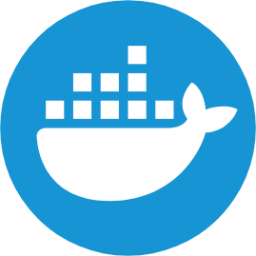

<div align = "center">
  
</div>

<div align="right">
    
    
    
    
    
    
    
    
    
    
</div>

<br>

<br>

<div align="right">
     <a href="./src/main/resources/static/translation/README.es.md" target="_blank">
       
   </a>
    <a href="https://github.com/andresWeitzel/emails-notifications-MailHog" target="_blank">
       
   </a>
</div>


<div align="center">

# User Management Email API

</div>

<br>

A comprehensive REST API developed with Spring Boot to manage users and send email notifications using Mailpit as the SMTP server. It integrates seamlessly with PostgreSQL for data storage, and includes features for audit logging, Prometheus monitoring, Grafana dashboards, and automatic API documentation with Swagger/OpenAPI. This API is designed for easy development, testing, and extension, making it ideal for building robust user management systems with comprehensive observability.

<br>

## Technologies and Dependencies

* Spring Boot: Core framework for building Java applications
* Spring Boot Starter Web: For creating RESTful web applications
* Spring Boot Starter Mail: For handling emails
* Spring Boot Starter Data JPA: For database operations
* Spring Boot Starter Actuator: For monitoring and metrics
* PostgreSQL: Database for data persistence
* Mailpit: SMTP server for local email testing
* Docker & Docker Compose: For containerization and orchestration
* Prometheus: For metrics collection
* Grafana: For metrics visualization
* Swagger/OpenAPI: For API documentation
* Lombok: For reducing boilerplate code
* JUnit: For unit testing

## Features

* User Management: Complete CRUD operations for user management
* Email Notifications: Automated email sending for user events
* Audit Logging: Comprehensive tracking of all system actions
* Monitoring: Real-time metrics and health checks
* API Documentation: Interactive Swagger UI for API exploration
* Containerization: Easy deployment with Docker
* Database Integration: Robust PostgreSQL integration
* Metrics Visualization: Grafana dashboards for system monitoring

## Requirements

* Java 17 or higher
* Docker and Docker Compose
* Maven for building the project
* PostgreSQL (if running without Docker)
* Mailpit (if running without Docker)

## Configuration and Execution (Docker Compose)
* If any of the following steps don't work, watch this [x](x)
* Repository Clone
```git
git clone https://github.com/andresWeitzel/email-api-service-MailPit
cd email-api-service-MailPit
```
<br>

#### Docker Compose Setup for Development

* Before building and running the containers, make sure you have Docker running (for Windows, use [Docker Desktop]([https://nodejs.org/en/download](https://www.docker.com/products/docker-desktop/)))
* Once installed, make sure Docker is running
```git
docker --version
```
`Important`: Check that no other service (ej:postgres) is running as a daemon on the system, otherwise a connection problem will occur on the port.
* Once Docker is running, you can build and deploy the containers with docker compose (This command is only needed once to build).
* The container for Mailpit and Postgres will be created. 
```git
docker-compose up --build
```
* After creating the containers with Docker Compose, each time we are going to start the containers we will use the following command, otherwise we will run it from Docker Desktop. Start the environment in development mode. Every time you want to run the app in development, you won't need to compile the jar. Simply run the following command:
```git
docker-compose up
```


<br>

<br>


### Testing de Endpoints de Servicios Dockerizados


- **Audit Log API**

  - `POST /api/v1/audit-log`  
  ➡️ [http://localhost:8080/api/v1/audit-log](http://localhost:8080/api/v1/audit-log)

  - `PUT /api/v1/audit-log/{id}`  
    ➡️ [http://localhost:8080/api/v1/audit-log/{id}](http://localhost:8080/api/v1/audit-log/1)
  
  - `DELETE /api/v1/audit-log/{id}`  
    ➡️ [http://localhost:8080/api/v1/audit-log/{id}](http://localhost:8080/api/v1/audit-log/1)
  
  - `GET /api/v1/audit-log`  
    ➡️ [http://localhost:8080/api/v1/audit-log](http://localhost:8080/api/v1/audit-log)
  
  - `GET /api/v1/audit-log/entity?entity={entityName}`  
    ➡️ [http://localhost:8080/api/v1/audit-log/entity?entity=User](http://localhost:8080/api/v1/audit-log/entity?entity=User)
  
  - `GET /api/v1/audit-log/action?action={actionType}`  
    ➡️ [http://localhost:8080/api/v1/audit-log/action?action=CREATE](http://localhost:8080/api/v1/audit-log/action?action=CREATE)
  
  - `GET /api/v1/audit-log/username?username={username}`  
    ➡️ [http://localhost:8080/api/v1/audit-log/username?username=admin](http://localhost:8080/api/v1/audit-log/username?username=admin)
  
  - `GET /api/v1/audit-log/details?details={details}`  
    ➡️ [http://localhost:8080/api/v1/audit-log/details?details=Created+new+user](http://localhost:8080/api/v1/audit-log/details?details=Created+new+user)

- **User API**
  
  - `POST /api/v1/users`  
    ➡️ [http://localhost:8080/api/v1/users](http://localhost:8080/api/v1/users)
  
  - `PUT /api/v1/users/{id}`  
    ➡️ [http://localhost:8080/api/v1/users/{id}](http://localhost:8080/api/v1/users/1)
  
  - `DELETE /api/v1/users/{id}`  
    ➡️ [http://localhost:8080/api/v1/users/{id}](http://localhost:8080/api/v1/users/1)
  
  - `GET /api/v1/users/{id}`  
    ➡️ [http://localhost:8080/api/v1/users/{id}](http://localhost:8080/api/v1/users/1)
  
  - `GET /api/v1/users`  
    ➡️ [http://localhost:8080/api/v1/users](http://localhost:8080/api/v1/users)

    

- **Swagger UI:**
  - `GET /swagger-ui.html`  
    ➡️ [[http://localhost:8080/swagger-ui.html](http://localhost:8080/swagger-ui/index.html)

  - `GET /v3/api-docs` – Documentación OpenAPI  
    ➡️ [http://localhost:8080/v3/api-docs](http://localhost:8080/v3/api-docs)


- **Actuator Endpoints:**
  - `GET /actuator`  
    ➡️ [http://localhost:8080/actuator](http://localhost:8080/actuator)

  - `GET /actuator/health`  
    ➡️ [http://localhost:8080/actuator/health](http://localhost:8080/actuator/health)

  - `GET /actuator/metrics`  
    ➡️ [http://localhost:8080/actuator/metrics](http://localhost:8080/actuator/metrics)

  - `GET /actuator/prometheus`  
    ➡️ [http://localhost:8080/actuator/prometheus](http://localhost:8080/actuator/prometheus)

  - `GET /actuator/env`  
    ➡️ [http://localhost:8080/actuator/env](http://localhost:8080/actuator/env)


- **MailPit:**

  - `Web UI`  
    ➡️ [http://localhost:8025](http://localhost:8025)
  
  - `SMTP Server` 
    ➡️ `smtp://localhost:1025`


- **Prometheus:**

  - `UI Web`
    ➡️ [http://localhost:9090](http://localhost:9090)


- **Grafana:**

  - `UI Web` 
    ➡️ [http://localhost:3000](http://localhost:3000)  
    🧾 Credenciales por defecto:
    - Usuario: `admin`
    - Contraseña: `admin`


- **PostgreSQL:**

  - `JDBC URL`  
    ➡️ `jdbc:postgresql://localhost:5432/mydatabase`  
    *  Usuario: `user`  
    *  Contraseña: `password`


